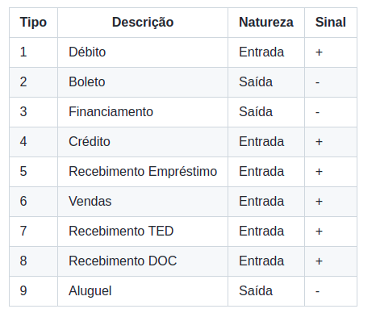

# cnab_parser

## Descrição

Esse é um projeto que permite a conversão de um arquivo cnab simples por meio de requisições normais e upload de arquivos txt.

## Tabela de Conteúdos

- [Diagramas](#diagramas)
- [Início Rápido](#início-rápido)
  - [Criação do ambiente virtual](#criação-do-ambiente-virtual)
  - [Entrando no ambiente virtual](#entrando-no-ambiente-virtual)
  - [Instalando dependências](#instalando-dependências)
  - [Rodando migrations](#rodando-migrations)
  - [Criando um superuser](#criando-um-superuser)
  - [Rodando o servidor](#rodando-o-servidor)
  - [Informações importantes](#informações-importantes)
  - [Upload de arquivo CNAB](#upload-de-arquivo-cnab)
  - [Rotas da documentação](#rotas-da-documentação)

## Diagramas

Transações:
<br>


Tipos de transações
<br>


## Início Rápido

- ### Criação do ambiente virtual

```python
python -m venv venv
```

Se você está no windows, precisa permitir a criação do ambiente virtual
```bash
Set-ExecutionPolicy AllSigned
```
<br>

- ### Entrando no ambiente virtual

linux:
```
source venv/bin/activate
```

windows:
```
.\venv\Scripts\activate
```

<br>

- ### Instalando dependências

Esse comando instala recursivamente todas as dependências no arquivo requirements.txt

```python
pip install -r requirements.txt
```

<br>

- ### Rodando migrations

Isso vai criar as tabelas do banco de dados e popular a tabela de tipos com os valores default

```python
python manage.py migrate
```

<br>


- ### Criando um superuser

Para poder fazer o upload de um arquivo é preciso entrar na seção de admin da applicação.

```python
python manage.py createsuperuser
```

Siga os passo do terminal para finalizar a criação

<br>

- ### Rodando o servidor

Esse comando vai rodar o servidor em http://localhost:8000/

```python
python manage.py runserver
```

<br>

- ### Informações importantes
  - Um arquivo chamado CNAB.txt é um exemplo de arquivo válido para upload que se encontra na base do projeto
  - Outro arquivo chamado cnab_parser.json é um arquivo que pode ser usando no insomnia para obter as rotas

<br>

- ### Upload de arquivo CNAB

Para fazer um upload de arquivo é necessário entrar na parte de admin da aplicação:
<br>
http://localhost:8000/admin/
<br>
Clique em **transactions** e em seguida em **Upload CNAB Text File**
<br>
Na tela de admin também é possível adicionar, editar e excluir transações.

<br>

- ### Rotas da documentação

Se tudo foi configurado corretamente, você será capaz de acessar a documentação das rotas por essas urls

http://localhost:8000/api/docs/
<br>
http://localhost:8000/api/docs/swagger-ui/

O primeiro é o download de um arquivo yaml e o segundo a interface da documentação.
<br>
A porta pode variar dependendo de onde o servidor está rodando. A porta padrão é 8000.
